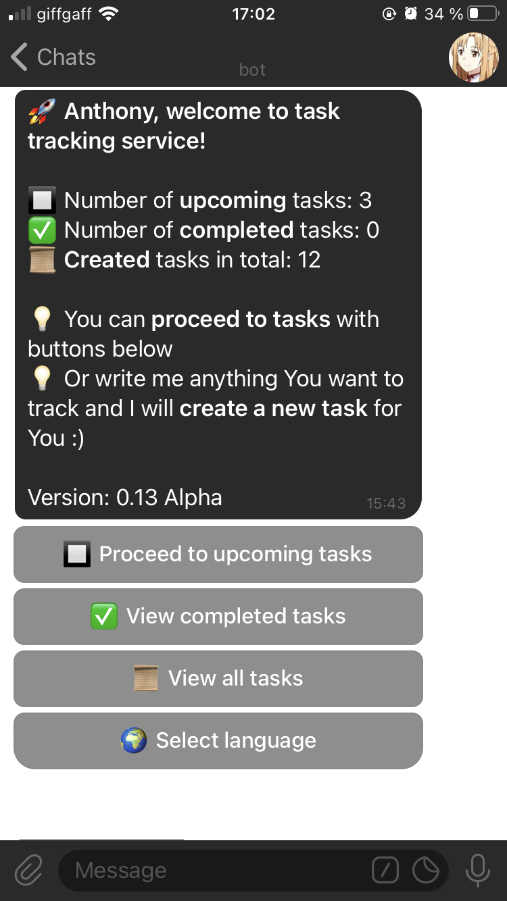
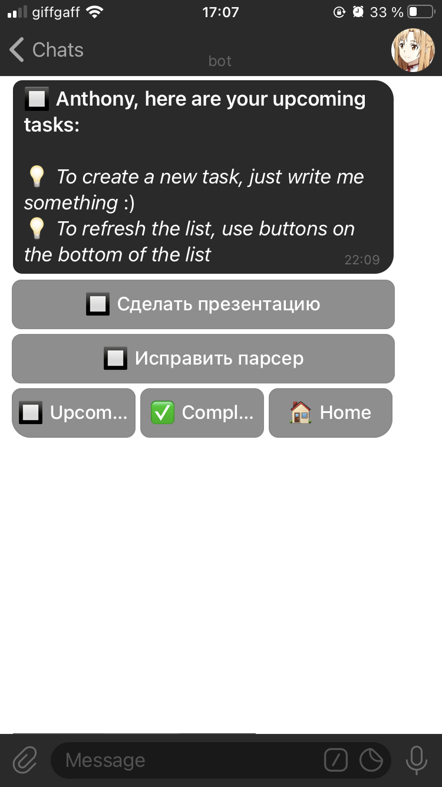
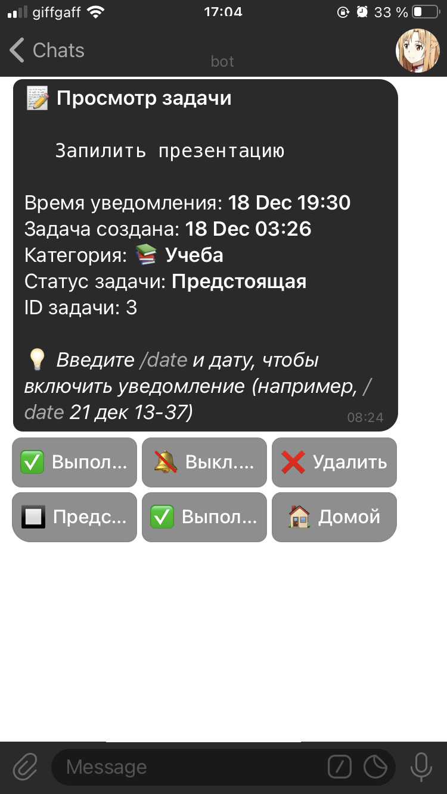
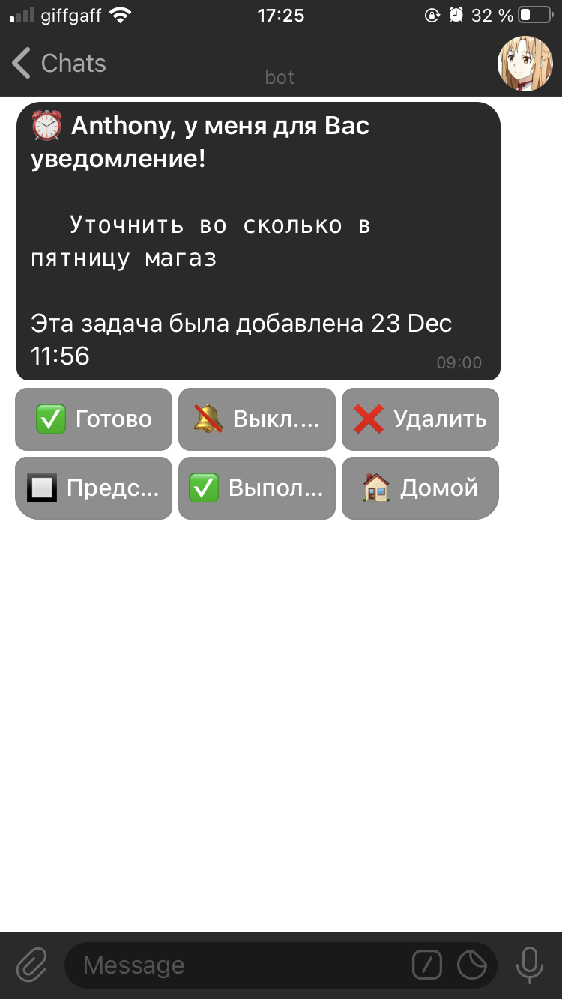

# Yet Another TimeTracker

## Технопарк Mail.ru. Python 2017. Курсовой проект

1) Команда №5
2) Yet Another Time Tracker
3) Тайм трекер, контролирующий задачи и распределение рабочего времени пользователя. Взаимодействие с пользователем происходит через Телеграмм (создание задач посредством репоста сообщения боту), а так же посредством отправки голосовых сообщений. Опционально - веб интерфейс для просмотра статистики
4) [Telegram bot repo](https://github.com/YetAnotherTimeTracker/yatt)
5) Команда:
 - Беляев Антон
 - Гимранова Екатерина
 - Калугина Дарья
 - Макаров Денис
 
 ## Try it yourself
 - Опробовать бота самостоятельно можно, добавив в Телеграмме `@YattTestBot` (или `@Yatt_bot`. Один из них отзовется) и, написав ему `/start`.
 
 Main screen             |  Task list
:-------------------------:|:-------------------------:
  |  

 Task page             |  Notification
:-------------------------:|:-------------------------:
  |  
 
 
## Quick start (dev mode)
- Склонируйте себе этот репозиторий: `git clone https://github.com/YetAnotherTimeTracker/yatt.git`
- Установите [Docker, Docker Compose](https://docs.docker.com/docker-for-mac/install/#download-docker-for-mac) (Docker не ниже версии 17.09)
- Запустите Docker Compose с PostgreSQL из корня проекта: `docker-compose up`
- Запустите бота c переменной окружения `BOT_ENV=dev` или `BOT_ENV=prod` и перменной-токеном `TOKEN=<your_token>`: `BOT_ENV=dev TOKEN=MY-TOKEN python3 bot.py`

## Deploy (prod mode)
- Добавьте логин аккаунта DockerHub в переменную в `scripts/deploy/creds/credentials.txt`
- Добавьте пароль аккаунта в `scripts/deploy/creds/dockerhub_psw.txt`
- Выполните сборку образа и пуш на DockerHub скриптом `scripts/deploy/push-image.sh`
- Скопируйте или создайте `docker-compose.yml` с контентом из `scripts/deploy/docker-compose.yml` в целевой директории на удаленной машине 
- Выполните `docker-compose up -d` для запуска контейнера (возможно, несколько раз)

#### Опционально:

- Пересборка образа: `docker build -t <название_образа> .`
- Пересборка через docker compose: `docker-compose build`
- Просмотр запущенных контейнеров: `docker ps` или `docker-compose ps`
- Просмотр логов: `docker logs -f <контейнер>`
- Просмотр образов: `docker images`
- Остановка контейнера: `docker stop <контейнер>`
